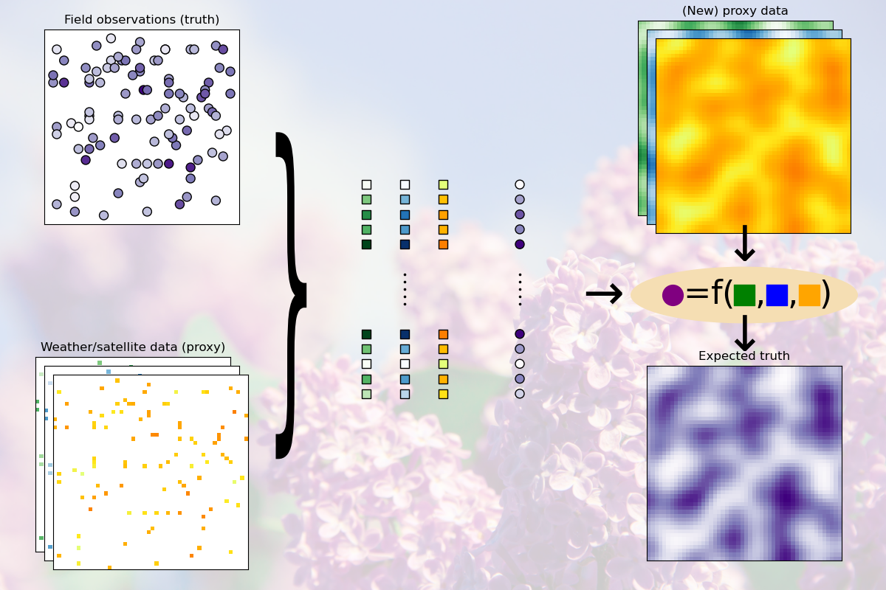

For detailed information and instruction, please refer to the
[documentation](https://springtime.readthedocs.io/)

<!--intro-start-->
# Springtime

Springtime is both a project and a python packaged aimed at streamlining
workflows for doing machine learning with phenological datasets.

Phenology is the scientific discipline in which we study the lifecycle of plants
and animals. A common objective is to develop (Machine Learning) models that can
explain or predict the occurrence of phenological events, such as the blooming
of plants. Since there is a variety of data sources and existing tools to
retrieve and analyse phenology data, it is easy to get lost and disorganized.

At the heart of springtime is a data representation following the scikit-learn
standard structure. The springtime python package implements (down)loaders for
various datasets that are able to convert the data to this same structure. Data
loading specifications can be exported to yaml recipes for easy sharing.

The documentation has an extensive user guide that shows how each of the data
loaders convert from the raw to the standardized data format. It also includes
examples of using various (combinations of) models.

The data structure proposed here is still not ideal, and should rather be seen
as a first step in standardizing workflows in phenological modelling. We hope it
will serve as a basis for discussion and further developments.

## Example task

Predict the day of first bloom of the common lilac given indirect observations
(e.g. satellite data) and/or other indicators (e.g. sunshine and temperature).

<!--intro-end-->

