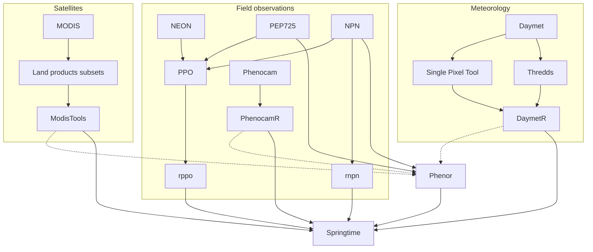

<!--
SPDX-FileCopyrightText: 2023 Springtime authors

SPDX-License-Identifier: Apache-2.0
-->

Springtime brings together datasets from various sources. Where possible, we use
existing tools to retrieve the data. The flowchart below illustrates the various
sources. Note that there might be multiple ways/tools to get data from the same
source. In springtime this is perfectly fine. We just accomodate and explain how
each of them works. It is up to the user to make an informed decision on what
way is right for them.

